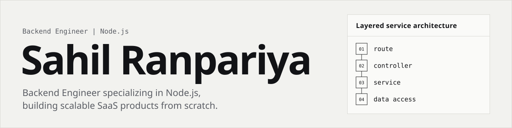

<picture>
  <source media="(prefers-color-scheme: dark)" srcset="assets/banner-dark.svg">
  
</picture>

Skilled in REST APIs, AI-powered applications, third-party integrations, OAuth authentication, webhooks, and event-driven systems across calendar, e-commerce, messaging, and payment domains, with a strong focus on clean architecture, system design, security, and performance.

[LinkedIn](https://www.linkedin.com/in/sahil-ranpariya/) &nbsp;·&nbsp; [Email](mailto:sahilranpariya60@gmail.com) &nbsp;·&nbsp; Surat, Gujarat

---

### Experience

**Backend Engineer, Sphere Tech** &nbsp;`Sep 2024 - Present`

- **Kandinsky**, multi-tenant art commerce platform. Built the bi-directional Shopify and Squarespace inventory/order sync engine with exactly-once processing, and eliminated oversell races on limited-edition inventory. Node.js · Express · PostgreSQL · BullMQ · Stripe
- **Abroad**, coaching and group-travel platform. Designed and built the scheduling subsystem across Google Calendar, Microsoft Graph, and Apple CalDAV, and automated collection of outstanding balances through Stripe off-session charges. Node.js · Express · MongoDB · Redis · Stripe

### Projects

| Project | Description | Stack |
| :-- | :-- | :-- |
| [**Stripe Billing Service**](https://github.com/sahil030804/Stripe-Integration) | Subscription and one-time payment flows, signature-verified webhook reconciliation with idempotency checks, and a coupon and promotion-code engine. | Express, Sequelize, PostgreSQL, BullMQ, Redis, Stripe |
| **JawabAI** | WhatsApp AI support platform: Embedded Signup onboarding, HMAC-verified webhooks, and a queue-based retrieval pipeline with local ONNX embeddings. | Express 5, PostgreSQL, Redis, BullMQ, Meta Graph API |
| **Switchboard** | Commerce operations platform: hashed-token session layer, per-request CSRF origin checks, and a checksummed forward-only migration runner. | Node 22, Express 5, PostgreSQL, Zod, Docker |

### Stack

| Area | Tools |
| :-- | :-- |
| **Languages** | JavaScript (Node.js), SQL |
| **Backend** | Express, REST API design, Passport/OAuth 2.0, JWT, Joi |
| **Databases** | PostgreSQL, MongoDB, Sequelize, Mongoose |
| **Queues & caching** | Redis, BullMQ, Bull |
| **Payments** | Stripe (Subscriptions, PaymentIntents, Connect, Invoices, webhooks) |
| **Integrations** | Shopify, Squarespace, Google Calendar, Microsoft Graph, Apple CalDAV, Mailgun |
| **Cloud / infra** | AWS S3, CloudFront, PM2, Nginx |
