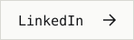

<picture>
  <source media="(prefers-color-scheme: dark)" srcset="assets/hero-dark.svg">
  
</picture>

<picture>
  <source media="(prefers-color-scheme: dark)" srcset="assets/terminal-dark.svg">
  
</picture>

### Currently

Backend Engineer at **Sphere Tech** since Sep 2024, building **Kandinsky**, a multi-tenant art commerce platform, and **Abroad**, a coaching and group-travel platform.

### Things I've built

  <a href="https://github.com/sahil030804/Stripe-Integration">
    <picture>
      <source media="(prefers-color-scheme: dark)" srcset="assets/card-stripe-billing-dark.svg">
      
    </picture>
  </a>
  <picture>
    <source media="(prefers-color-scheme: dark)" srcset="assets/card-jawabai-dark.svg">
    
  </picture>
  <picture>
    <source media="(prefers-color-scheme: dark)" srcset="assets/card-switchboard-dark.svg">
    
  </picture>

### Stack

<picture>
  <source media="(prefers-color-scheme: dark)" srcset="assets/stack-dark.svg">
  
</picture>

### Connect

<a href="https://www.linkedin.com/in/sahil-ranpariya/">
  <picture>
    <source media="(prefers-color-scheme: dark)" srcset="assets/btn-linkedin-dark.svg">
    
  </picture>
</a>
<a href="mailto:sahilranpariya60@gmail.com">
  <picture>
    <source media="(prefers-color-scheme: dark)" srcset="assets/btn-email-dark.svg">
    
  </picture>
</a>

<!-- Animated SVGs are generated by tools/generate.py -->
